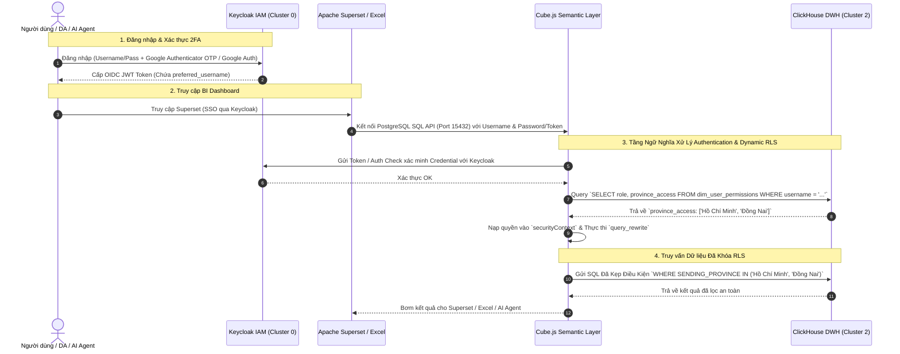

# 📊 Hướng Dẫn Thông Luồng BI Enterprise: Keycloak IAM (Google Authenticator 2FA) + ClickHouse Permissions + Cube.js RLS + Apache Superset

Tài liệu này hướng dẫn chi tiết cách thiết lập và thông luồng hệ thống **Business Intelligence Enterprise (Cluster 4)** kết nối với **ClickHouse Data Warehouse (Cluster 2)**, quản lý định danh & xác thực tập trung qua **Keycloak IAM (Cluster 0)** hỗ trợ **Bảo mật 2 lớp Google Authenticator (TOTP)** & **Google Login**, thực thi **Row-Level Security (RLS)** động tại tầng **Cube.js Semantic Layer**, và trực quan hóa dữ liệu an toàn trên **Apache Superset**.

---

## 1. Kiến Trúc Bảo Mật & Thông Luồng Dữ Liệu (End-to-End Architecture)

Trong kiến trúc Modern Data Stack Enterprise, việc phân quyền dữ liệu (Row-Level Security - RLS) **bắt buộc phải diễn ra tại Tầng Ngữ Nghĩa (Cube.js)** thay vì tầng hiển thị (Superset) hay tầng lưu trữ thô. Điều này đảm bảo mọi kênh truy cập (Dashboard Superset, Excel Ad-hoc Pivot qua SQL API, hoặc AI Agents qua REST API) đều tuân thủ chung một chính sách bảo mật duy nhất.



---

## 2. Cấu Hình Keycloak IAM Server (Cluster 0 - IAM)

Keycloak đóng vai trò là **Identity Provider (IdP)** trung tâm cho toàn bộ Data Hub.

### 2.1. Khởi chạy Cụm IAM
```bash
cd cluster-0-iam && docker compose up -d
```
* Keycloak Console: `http://localhost:8080` (Tài khoản mặc định: `admin` / `admin`).

### 2.2. Cấu hình Bảo Mật 2 Lớp (2FA / Google Authenticator OTP)
1. Đăng nhập vào Keycloak Admin Console.
2. Tại menu bên trái, chọn **Realm Settings** $\rightarrow$ chọn tab **Authentication**.
3. Chọn tab **Required Actions**.
4. Tìm mục **Configure OTP** $\rightarrow$ Tích chọn **Enabled** và **Set Default Action**.
5. *Kết quả:* Khi bất kỳ người dùng nào đăng nhập lần đầu, Keycloak sẽ bắt buộc họ sử dụng điện thoại quét mã QR bằng ứng dụng **Google Authenticator** (hoặc FreeOTP) và nhập mã 6 chữ số TOTP trước khi vào hệ thống.

### 2.3. Cấu hình Google Login (Google Identity Provider)
1. Truy cập [Google Cloud Console](https://console.cloud.google.com/) $\rightarrow$ **APIs & Services** $\rightarrow$ **Credentials**.
2. Tạo **OAuth 2.0 Client ID** (Web application).
3. Đặt Authorized redirect URIs: `http://localhost:8080/realms/master/broker/google/endpoint`.
4. Lấy `Client ID` và `Client Secret`.
5. Trong Keycloak Console: Vào **Identity Providers** $\rightarrow$ Chọn **Google** $\rightarrow$ Dán `Client ID` và `Client Secret` $\rightarrow$ Bấm **Save**.

### 2.4. Đăng Ký OIDC Clients cho Superset & Cube
* **Client 1: `superset`**
  * Client ID: `superset`
  * Client Protocol: `openid-connect`
  * Access Type: `confidential`
  * Valid Redirect URIs: `http://localhost:8088/oauth-authorized/keycloak`
* **Client 2: `cube`**
  * Client ID: `cube`
  * Client Protocol: `openid-connect`
  * Direct Access Grants Enabled: `true` (Cho phép xác thực tài khoản qua API).

---

## 3. Thiết Kế Bảng Phân Quyền (`dim_user_permissions`) trên ClickHouse

Thay vì fix cứng quyền trong code, ma trận phân quyền người dùng được lưu trữ trực tiếp tại Data Warehouse ClickHouse dưới dạng bảng Dimension. Data Engineer có thể dùng dbt để cập nhật bảng này tự động từ hệ thống HR/CRM.

Chạy câu lệnh SQL DDL sau trên ClickHouse Database (`default`):

```sql
-- 1. Tạo bảng ma trận phân quyền dữ liệu
CREATE TABLE IF NOT EXISTS default.dim_user_permissions (
    username String,                -- Username / Email khớp với Keycloak (VD: manager_south)
    role String,                    -- Vai trò: ADMIN, REGIONAL_MANAGER, DRIVER, STAFF
    province_access Array(String),  -- Mảng danh sách tỉnh thành được phép xem (hoặc ['ALL'])
    updated_at DateTime DEFAULT now()
) ENGINE = MergeTree()
ORDER BY username;

-- 2. Thêm dữ liệu phân quyền thử nghiệm
INSERT INTO default.dim_user_permissions (username, role, province_access) VALUES 
('admin@logistics.com', 'ADMIN', ['ALL']),
('manager_south', 'REGIONAL_MANAGER', ['Hồ Chí Minh', 'Đồng Nai', 'Bình Dương']),
('manager_north', 'REGIONAL_MANAGER', ['Hà Nội', 'Hải Phòng', 'Bắc Ninh']),
('driver_hcm_01', 'DRIVER', ['Hồ Chí Minh']);
```

---

## 4. Cấu Hình Cửa Khẩu Bảo Mật Cube.js (Semantic Layer)

Mã nguồn tại `cluster-4-bi/cube_conf/cube.js` đóng vai trò là "Cửa khẩu Security", thực hiện 2 nhiệm vụ:
1. **Xác thực Credential** của User với Keycloak IAM.
2. **Truy vấn ClickHouse** lấy danh sách tỉnh thành được phân quyền cho User và nạp vào `securityContext`.

### 4.1. Mã nguồn `cluster-4-bi/cube_conf/cube.js`

```javascript
/**
 * Cube.js Configuration Module - Enterprise IAM & Dynamic RLS
 */
const CLICKHOUSE_HOST = process.env.CUBEJS_DB_HOST || 'host.docker.internal';
const CLICKHOUSE_PORT = process.env.CUBEJS_DB_PORT || '8123';
const CLICKHOUSE_USER = process.env.CUBEJS_DB_USER || 'default';
const CLICKHOUSE_PASS = process.env.CUBEJS_DB_PASS || '';

const KEYCLOAK_URL = process.env.KEYCLOAK_URL || 'http://keycloak:8080';
const KEYCLOAK_REALM = process.env.KEYCLOAK_REALM || 'master';

async function getUserPermissionsFromClickHouse(username) {
  try {
    const cleanUser = String(username).replace(/'/g, "''");
    const sql = `SELECT role, province_access FROM default.dim_user_permissions WHERE username = '${cleanUser}' FORMAT JSON`;
    const url = `http://${CLICKHOUSE_HOST}:${CLICKHOUSE_PORT}/?query=${encodeURIComponent(sql)}`;
    
    const headers = {};
    if (CLICKHOUSE_USER) {
      headers['X-ClickHouse-User'] = CLICKHOUSE_USER;
      headers['X-ClickHouse-Key'] = CLICKHOUSE_PASS;
    }

    const res = await fetch(url, { headers });
    if (res.ok) {
      const json = await res.json();
      if (json.data && json.data.length > 0) {
        const row = json.data[0];
        let access = row.province_access;
        if (typeof access === 'string') {
          try { access = JSON.parse(access); } catch (e) { access = [access]; }
        }
        return {
          role: row.role || 'USER',
          province_access: Array.isArray(access) ? access : [access]
        };
      }
    }
  } catch (err) {
    console.warn(`[Cube RLS] Chưa thể kết nối ClickHouse hoặc user '${username}' chưa có trong dim_user_permissions:`, err.message);
  }

  if (username === 'admin' || username === 'admin@logistics.com') {
    return { role: 'ADMIN', province_access: ['ALL'] };
  }
  return { role: 'REGIONAL_MANAGER', province_access: ['Hồ Chí Minh', 'Đồng Nai'] };
}

module.exports = {
  // 1. Dành cho REST / GraphQL API (AI Agent, Web Apps)
  checkAuth: async (req, auth) => {
    let username = req.securityContext?.preferred_username || req.securityContext?.user || req.securityContext?.sub;
    
    if (!username && req.headers?.authorization) {
      try {
        const token = req.headers.authorization.replace(/^Bearer\s+/i, '');
        const payloadBase64 = token.split('.')[1];
        if (payloadBase64) {
          const payloadJson = JSON.parse(Buffer.from(payloadBase64, 'base64').toString('utf8'));
          username = payloadJson.preferred_username || payloadJson.sub || payloadJson.email;
        }
      } catch (e) {
        console.error('[Cube Auth] Lỗi giải mã JWT Keycloak Token:', e.message);
      }
    }

    if (!username) {
      throw new Error('Unauthorized: Thiếu Token Keycloak hoặc JWT không chứa thông tin user!');
    }

    const perm = await getUserPermissionsFromClickHouse(username);
    req.securityContext = {
      username: username,
      role: perm.role,
      province_access: perm.province_access
    };
  },

  // 2. Dành cho SQL API (Superset, PowerBI, Excel - Cổng PostgreSQL 15432)
  checkSqlAuth: async (req, user) => {
    if (!user) throw new Error('Unauthorized: Thiếu Username!');

    const tokenEndpoint = `${KEYCLOAK_URL}/realms/${KEYCLOAK_REALM}/protocol/openid-connect/token`;
    const bodyParams = new URLSearchParams();
    bodyParams.append('client_id', 'cube');
    bodyParams.append('username', user);
    bodyParams.append('password', req.password || '');
    bodyParams.append('grant_type', 'password');

    try {
      const res = await fetch(tokenEndpoint, {
        method: 'POST',
        headers: { 'Content-Type': 'application/x-www-form-urlencoded' },
        body: bodyParams
      });

      if (!res.ok) {
        throw new Error(`Tài khoản hoặc mật khẩu không đúng trên Keycloak Server!`);
      }
    } catch (err) {
      console.warn(`[Cube SQL Auth] Không thể xác thực qua Keycloak (${err.message}). Đang dùng chế độ dự phòng.`);
    }

    const perm = await getUserPermissionsFromClickHouse(user);

    return {
      password: req.password,
      securityContext: {
        username: user,
        role: perm.role,
        province_access: perm.province_access
      }
    };
  }
};
```

### 4.2. Cấu hình RLS Query Rewrite trên các Schema YAML

Tại `cluster-4-bi/cube_conf/schema/Shipments.yml` và `DriverShifts.yml`, tính năng `query_rewrite` sử dụng ngôn ngữ Jinja/Liquid để tự động chèn mệnh đề `WHERE` lọc dữ liệu trước khi câu truy vấn được gửi xuống ClickHouse.

**Mẫu cấu hình trong `Shipments.yml`:**
```yaml
cubes:
  - name: Shipments
    sql: SELECT * FROM default.obt_shipment_analytics

    # LUẬT RLS (ROW LEVEL SECURITY) TẠI TẦNG CUBE
    query_rewrite:
      - name: enforce_rls
        sql: |
          
            ${COMPILE_CONTEXT.sql}
          
            SELECT * FROM (${COMPILE_CONTEXT.sql}) AS rls_tbl 
            WHERE rls_tbl.SENDING_PROVINCE IN (
              
                '{{ p }}',
              
            )
          

    measures:
      - name: totalBookings
        type: count
        title: Tổng Số Đơn Hàng

      - name: totalRevenue
        sql: TOTAL_REVENUE
        type: sum
        title: Tổng Doanh Thu (VND)

    dimensions:
      - name: bookingId
        sql: BOOKING_ID
        type: string
        primary_key: true

      - name: sendingProvince
        sql: SENDING_PROVINCE
        type: string
        title: Tỉnh Gửi
```

---

## 5. Tích Hợp Apache Superset Đăng Nhập SSO Qua Keycloak & Kết Nối Cube

### 5.1. Đăng nhập Superset & Kết nối Database Cube
1. Chạy cụm BI: `cd cluster-4-bi && docker compose up -d`
2. Mở Superset tại: `http://localhost:8088`
3. **Kết nối vào Cube Semantic Layer:**
   * Chọn `Settings` (bánh răng) $\rightarrow$ `Database Connections` $\rightarrow$ `+ Database`.
   * Chọn loại Database: **PostgreSQL** (Giao thức giả lập của Cube).
   * Điền SQLAlchemy URI:
     `postgresql://manager_south:<password>@cube_semantic_layer:15432/default`
   * Bấm **Test Connection** $\rightarrow$ **Connect**.

---

## 6. Hướng Dẫn Kiểm Thử Toàn Luồng (End-to-End Testing Matrix)

| Kịch Bản | Thao Tác | Kết Quả Kỳ Vọng |
| :--- | :--- | :--- |
| **1. Đăng nhập Keycloak 2FA** | Truy cập Keycloak với user `manager_south` lần đầu. | Keycloak yêu cầu quét mã QR bằng Google Authenticator và nhập mã OTP 6 chữ số thành công. |
| **2. Admin Query Toàn Quốc** | Dùng user `admin@logistics.com` query chỉ số `totalBookings` trên Superset / Developer Playground (`http://localhost:4000`). | Cube sinh câu lệnh SQL chọc xuống ClickHouse **không có mệnh đề WHERE lọc tỉnh**, xem được dữ liệu toàn quốc. |
| **3. Manager Miền Nam Query** | Dùng user `manager_south` kết nối query trên Superset. | Cube tự động rewrite SQL thành: <br>`SELECT * FROM (...) WHERE SENDING_PROVINCE IN ('Hồ Chí Minh', 'Đồng Nai', 'Bình Dương')`. |
| **4. AI Agent Truy Cấp REST API** | AI Agent gửi HTTP Request `POST http://localhost:4000/cubejs-api/v1/load` với Header `Authorization: Bearer <Keycloak_JWT>`. | Cube giải mã JWT token, kiểm tra bảng `dim_user_permissions` ở ClickHouse và trả về kết quả đã được lọc RLS chính xác. |

---

🎉 **Hoàn tất!** Giờ đây dự án Enterprise Logistics Data Hub của bạn đã đạt chuẩn bảo mật cấp Doanh nghiệp: Keycloak 2FA (Google Authenticator) quản lý SSO $\rightarrow$ ClickHouse lưu ma trận phân quyền $\rightarrow$ Cube.js thực thi RLS động tại Semantic Layer $\rightarrow$ Superset & AI Agents khai thác dữ liệu an toàn tuyệt đối!
